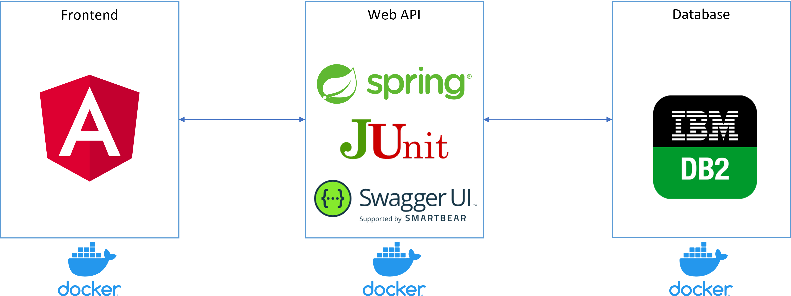

# Soccer Activities Management

## Descrizione
Il sito Soccer Activities Management è una piattaforma per la  gestione delle attività sportive attraverso una comunità di utenti.

## Specifiche
L’applicazione web ha le seguenti caratteristiche:
1. Possibilità di creare gli utenti per i due ruoli principali: arbitri e gestori di squadra
2. Possibilità di creare i diversi tornei, di disegnarne lo schema. Ogni torneo ha: nome, descrizione e tipo (all’italiana o ad eliminazione)
3. Un torneo è costituito da diversi gironi o fasi, in base alla tipologia di torneo. Un girone ha un nome (ad esempio: girone 1) ed è costituito da un insieme di gare. Una fase ha un nome (ad esempio: semifinale 1) ed è costituita da una sola gara
4. Una gara è descritta da: data e ora, luogo, nomi delle squadre che si sfidano, un arbitro
5. Per ogni torneo è associata una classifica generale che viene aggiornata sulla base dei referti di gara compilati dagli arbitri
6. Possibilità per il gestore di una squadra di creare una squadra con una rosa di massimo 36 giocatori. Ogni squadra ha un nome e può avere uno sponsor. Per ogni giocatore il gestore può specificare: nome, cognome, luogo e data di nascita, numero di maglia e foto
7. Per ogni gara cui la squadra è assegnata, il gestore della squadra deve fornire la formazione della squadra composta da nome e cognome dei giocatori e rispettivi ruoli
8. A gara terminata l’arbitro dovrà compilare un referto in cui annoterà: l’orario effettivo di inizio e di fine della gara, risultato finale, numero di reti con i rispettivi giocatori che li hanno realizzati, i giocatori espulsi per ogni squadra e i giocatori ammoniti per ogni squadra
9. Possibilità di selezionare il torneo desiderato e visualizzare:
    - La pagina relativa ad una gara con: nomi delle squadre, formazioni e referti
    - La pagina relativa ad una squadra con la rosa dei giocatori e il calendario delle partite
    - La pagina relativa ad un giocatore con le statistiche di gioco (punti realizzati, espulsioni e ammonizioni) per quel torneo

Il sistema prevede che le categorie di utenti sia così rappresentata:
* **Amministratori** possono effettuare i punti dal 1 al 5 compresi
* **Gestori di squadra** possono effettuare i punti dal 6 al 7 compresi
* **Arbitri** possono effettuare solamente il punto 8
* **Utenti pubblici** possono effettuare solamente il punto 9

## Architettura
L’applicazione web è formata da 3 componenti:
- **Frontend:** sviluppato utilizzando il linguaggio [typescript](https://www.typescriptlang.org/) e il framework [Angular](https://angular.io/)
- **Web API:** sviluppato utilizzando il linguaggio Java e il framework [Spring](https://spring.io/). Include una suite di unit test sviluppata utilizzando i framework [Junit](https://junit.org/junit5/) e [Mockito](https://site.mockito.org/). Include la documentazione delle web api utilizzando [Swagger UI](https://swagger.io/tools/swagger-ui/)
- **Database:** sviluppato utilizzando il database relazionale [IBM DB2](https://hub.docker.com/r/ibmcom/db2)



L’applicazione web è sviluppata seguendo il paradigma [REST](https://en.wikipedia.org/wiki/Representational_state_transfer).

Frontend, Web-Api e Database sono distribuiti utilizzando i container docker (un container per ogni componente). Per il deployment locale dei componenti si utilizza [Docker Compose](https://docs.docker.com/compose/).

## Build del sistema

### Prerequisiti
* Docker v. 20.10.11 o superiori
* Docker Compose version v2.2.1

### Build/Deploy su Windows
Eseguire lo script ```run-system.bat```

### Note
Per il deploy del sistema è possibile avviare separatamente i container docker (vedi il file [env.dev](config/env.dev) per le varie configurazioni da apportare) oppure è possibile effettuare il deploy dei vari componenti su una Virtual Machine (in tal caso vedere i Dockerfile di ogni componente per le dipendenze da installare sia in fase di build che in fase di deploy)

## Come contribuire al progetto
Se vuoi partecipare allo sviluppo di questo progetto o per ulteriori delucidazioni contattami all'indirizzo: [michele.vaccari@edu.unife.it](mailto:michele.vaccari@edu.unife.it)